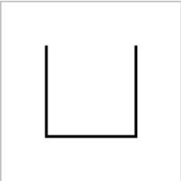
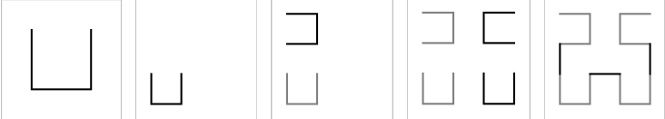
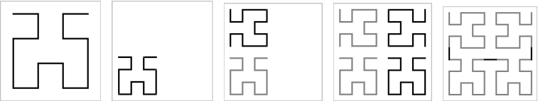
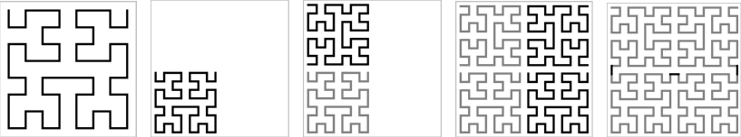

Divide et impera


Numim curba de ordin Hilbert de ordinul K curba realizata dupa urmatoarele reguli ce trece prin fiecare nod al unei grile de 2K*2K noduri si trece prin noduri vecine ale grilei. Curba Hilbert de ordinul 1 este o curbă simpla:



Descrise în următoarele imagini sunt trecerile de la o curbă de ordin x la o curbă deordin x+1:

Ordin 1 -> Ordin 2



Ordin 2 -> Ordin 3



Ordin 3 -> Ordin 4



Sa se calculeze in cati pasi se ajunge la coordonatele (x,y) daca punctele din patrat sunt parcurse în ordinea data de curba Hilbert de ordin K.
Date de intrare:
Fisierul fractal.in care contine pe primele randuri numerele K, x si y, unde K este ordinul unei curbe, iar x si ysunt coordonate intregi in interiorul unui patrat de dimensiune 2K*2K.
Date de ieșire:
Fișierul de ieșire fractal.out in care se va scrie numărul de pasi in care se ajunge la (x,y).


```
#include <stdio.h>
#include <assert.h>

void scriere_fisier()
{
    FILE *f = fopen("fractal.in", "w");
    if(f == NULL)
    {
        printf("Eroare deschidere fisier(scriere)");
        return;
    }
    int k, x, y;
    printf("Introduceti k, x, y:");
    scanf("%d %d %d", &k, &x, &y);
    fprintf(f,"%d\n", k);
    fprintf(f,"%d\n", x);
    fprintf(f,"%d\n", y);
    fclose(f);
}

void citire_fisier(int* k, int* x, int* y)
{
    FILE *f = fopen("fractal.in", "r");
    if(f == NULL)
    {
        printf("Eroare deschidere fisier(citire)");
        return;
    }
    fscanf(f, "%d", k);
    fscanf(f, "%d", x);
    fscanf(f, "%d", y);
    fclose(f);
}
/*
 * poz = 0
 * |  |
 * |__|
 * poz = 1
 * __
 *   |
 * __|
 * poz = 2
 *  __
 * |
 * |__
 * poz = 3
 * |--|
 * |  |
 */

int curba_hilbert(int x, int y, int x1, int y1, int dim, int poz, int sens)
{
    if(dim == 2)
    {
        if(poz == 0)
        {
            if(sens == 0)
            {
                if(x == x1 && y == y1)
                    return 0;
                if(x == x1 && y == y1 + 1)
                    return 1;
                if(x == x1 + 1 && y == y1 + 1)
                    return 2;
                return 3;
            }
            else
            {
                if(x == x1 && y == y1)
                    return 3;
                if(x == x1 && y == y1 + 1)
                    return 2;
                if(x == x1 + 1 && y == y1 + 1)
                    return 1;
                return 0;
            }
        }
        if(poz == 1)
        {
            if(sens == 0)
            {
                if(x == x1 && y == y1)
                    return 3;
                if(x == x1 + 1 && y == y1)
                    return 2;
                if(x == x1 + 1 && y == y1 + 1)
                    return 1;
                return 0;

            }
            else
            {
                if(x == x1 && y == y1)
                    return 0;
                if(x == x1 + 1 && y == y1)
                    return 1;
                if(x == x1 + 1 && y == y1 + 1)
                    return 2;
                return 3;
            }
        }
        if(poz == 2)
        {
            if(sens == 0)
            {
                if(x == x1 + 1 && y == y1 + 1)
                    return 3;
                if(x == x1 && y == y1 + 1)
                    return 2;
                if(x == x1 && y == y1)
                    return 1;
                return 0;
            }
            else
            {
                if(x == x1 + 1 && y == y1 + 1)
                    return 0;
                if(x == x1 && y == y1 + 1)
                    return 1;
                if(x == x1 && y == y1)
                    return 2;
                return 3;
            }
        }
        if(poz == 3)
        {
            if(sens == 0)
            {
                if(x == x1 + 1 && y == y1 + 1)
                    return 0;
                if(x == x1 + 1 && y == y1)
                    return 1;
                if(x == x1 && y == y1)
                    return 2;
                return 3;
            }
            else
            {
                if(x == x1 + 1 && y == y1 + 1)
                    return 3;
                if(x == x1 + 1 && y == y1)
                    return 2;
                if(x == x1 && y == y1)
                    return 1;
                return 0;
            }
        }
        return 0;
    }
    else
    {
        int dim_patrat = 0;
        int cop = dim / 2;
        while(cop > 1)
        {
            dim_patrat = dim_patrat * 4 + 3;
            cop /= 2;
        }
        if(poz == 0)
        {
            if(sens == 0)
            {
                if(x < (x1 + dim/2) && y < (y1 + dim/2))
                    return curba_hilbert(x, y, x1, y1, dim/2, 1, 1);
                if(x < (x1 + dim/2) && y > (y1 + dim/2 - 1))
                    return 1 + dim_patrat + curba_hilbert(x, y, x1, y1 + dim/2, dim/2, 0, 0);
                if(x > (x1 + dim/2 - 1) && y > (y1 + dim/2 - 1))
                    return 2 + 2 * dim_patrat + curba_hilbert(x, y, x1 + dim/2, y1 + dim/2, dim/2, 0, 0);
                if(x > (x1 + dim/2 - 1) && y < (y1 + dim/2))
                    return 3 + 3 * dim_patrat + curba_hilbert(x, y, x1 + dim/2, y1, dim/2, 2, 1);
            }
            else
            {
                if(x < (x1 + dim/2) && y < (y1 + dim/2))
                    return 3 + 3 * dim_patrat + curba_hilbert(x, y, x1, y1, dim/2, 1, 0);
                if(x < (x1 + dim/2) && y > (y1 + dim/2 - 1))
                    return 2 + 2 * dim_patrat + curba_hilbert(x, y, x1, y1 + dim/2, dim/2, 0, 1);
                if(x > (x1 + dim/2 - 1) && y > (y1 + dim/2 - 1))
                    return 1 + dim_patrat + curba_hilbert(x, y, x1 + dim/2, y1 + dim/2, dim/2, 0, 1);
                if(x > (x1 + dim/2 - 1) && y < (y1 + dim/2))
                    return curba_hilbert(x, y, x1 + dim/2, y1, dim/2, 2, 0);
            }

        }
        if(poz == 1)
        {
            if(sens == 0)
            {
                if(x < (x1 + dim/2) && y < (y1 + dim/2))
                    return 3 + 3 * dim_patrat + curba_hilbert(x, y, x1, y1, dim/2, 0, 1);
                if(x < (x1 + dim/2) && y > (y1 + dim/2 - 1))
                    return curba_hilbert(x, y, x1, y1 + dim/2, dim/2, 1, 0);
                if(x > (x1 + dim/2 - 1) && y > (y1 + dim/2 - 1))
                    return 1 + dim_patrat + curba_hilbert(x, y, x1 + dim/2, y1 + dim/2, dim/2, 1, 0);
                if(x > (x1 + dim/2 - 1) && y < (y1 + dim/2))
                    return 2 + 2 * dim_patrat + curba_hilbert(x, y, x1 + dim/2, y1, dim/2, 3, 1);
            }
            else
            {
                if(x < (x1 + dim/2) && y < (y1 + dim/2))
                    return curba_hilbert(x, y, x1, y1, dim/2, 0, 0);
                if(x < (x1 + dim/2) && y > (y1 + dim/2 - 1))
                    return 3 + 3 * dim_patrat + curba_hilbert(x, y, x1, y1 + dim/2, dim/2, 1, 1);
                if(x > (x1 + dim/2 - 1) && y > (y1 + dim/2 - 1))
                    return 2 + 2 * dim_patrat + curba_hilbert(x, y, x1 + dim/2, y1 + dim/2, dim/2, 1, 1);
                if(x > (x1 + dim/2 - 1) && y < (y1 + dim/2))
                    return 1 + dim_patrat + curba_hilbert(x, y, x1 + dim/2, y1, dim/2, 3, 0);
            }

        }
        if(poz == 2)
        {
            if(sens == 0)
            {
                if(x < (x1 + dim/2) && y < (y1 + dim/2))
                    return 1 + dim_patrat + curba_hilbert(x, y, x1, y1, dim/2, 2, 0);
                if(x < (x1 + dim/2) && y > (y1 + dim/2 - 1))
                    return 2 + 2 * dim_patrat + curba_hilbert(x, y, x1, y1 + dim/2, dim/2, 2, 0);
                if(x > (x1 + dim/2 - 1) && y > (y1 + dim/2 - 1))
                    return 3 + 3 * curba_hilbert(x, y, x1 + dim/2, y1 + dim/2, dim/2, 3, 1);
                if(x > (x1 + dim/2 - 1) && y < (y1 + dim/2))
                    return curba_hilbert(x, y, x1 + dim/2, y1, dim/2, 0, 1);
            }
            else
            {
                if(x < (x1 + dim/2) && y < (y1 + dim/2))
                    return 2 + 2 * dim_patrat + curba_hilbert(x, y, x1, y1, dim/2, 2, 1);
                if(x < (x1 + dim/2) && y > (y1 + dim/2 - 1))
                    return 1 + dim_patrat + curba_hilbert(x, y, x1, y1 + dim/2, dim/2, 2, 1);
                if(x > (x1 + dim/2 - 1) && y > (y1 + dim/2 - 1))
                    return curba_hilbert(x, y, x1 + dim/2, y1 + dim/2, dim/2, 3, 0);
                if(x > (x1 + dim/2 - 1) && y < (y1 + dim/2))
                    return 3 + 3 * dim_patrat + curba_hilbert(x, y, x1 + dim/2, y1, dim/2, 0, 0);
            }

        }
        if(poz == 3)
        {
            if(sens == 0)
            {
                if(x < (x1 + dim/2) && y < (y1 + dim/2))
                    return 2 + 2 * dim_patrat + curba_hilbert(x, y, x1, y1, dim/2, 3, 1);
                if(x < (x1 + dim/2) && y > (y1 + dim/2 - 1))
                    return 3 + 3 * dim_patrat + curba_hilbert(x, y, x1, y1 + dim/2, dim/2, 1, 0);
                if(x > (x1 + dim/2 - 1) && y > (y1 + dim/2 - 1))
                    return curba_hilbert(x, y, x1 + dim/2, y1 + dim/2, dim/2, 2, 0);
                if(x > (x1 + dim/2 - 1) && y < (y1 + dim/2))
                    return 1 + dim_patrat + curba_hilbert(x, y, x1 + dim/2, y1, dim/2, 2, 1);
            }
            else
            {
                if(x < (x1 + dim/2) && y < (y1 + dim/2))
                    return 1 + dim_patrat + curba_hilbert(x, y, x1, y1, dim/2, 2, 0);
                if(x < (x1 + dim/2) && y > (y1 + dim/2 - 1))
                    return curba_hilbert(x, y, x1, y1 + dim/2, dim/2, 3, 1);
                if(x > (x1 + dim/2 - 1) && y > (y1 + dim/2 - 1))
                    return 3 + 3 * dim_patrat + curba_hilbert(x, y, x1 + dim/2, y1 + dim/2, dim/2, 3, 1);
                if(x > (x1 + dim/2 - 1) && y < (y1 + dim/2))
                    return 2 + 2 * dim_patrat + curba_hilbert(x, y, x1 + dim/2, y1, dim/2, 1, 0);
            }
        }

    }
    return 0;
}

void verificare()
{
    assert(curba_hilbert(3, 5, 0, 0, 8, 0, 0) == 28);
    assert(curba_hilbert(4, 6, 0, 0, 8, 0, 0) == 36);
    assert(curba_hilbert(0, 0, 0, 0, 8, 0, 0) == 0);
    assert(curba_hilbert(6, 11, 0, 0, 16, 0, 0) == 115);
    assert(curba_hilbert(9, 15, 0, 0, 16, 0, 0) == 150);
    assert(curba_hilbert(1, 1, 0, 0, 4, 0, 0) == 2);
    assert(curba_hilbert(3, 0, 0, 0, 4, 0, 0) == 15);

}

int main() {
//    int k, x, y;
//    scriere_fisier();
//    citire_fisier(&k, &x, &y);
//    int prod = 1;
//    for(int i = 0; i < k; i++)
//        prod = prod * 2;
//    printf("%d", curba_hilbert(x, y, 0, 0, prod, 0, 0));
    verificare();
    return 0;
}
```